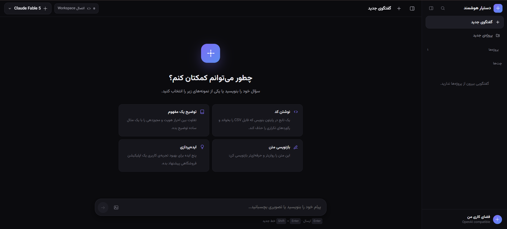
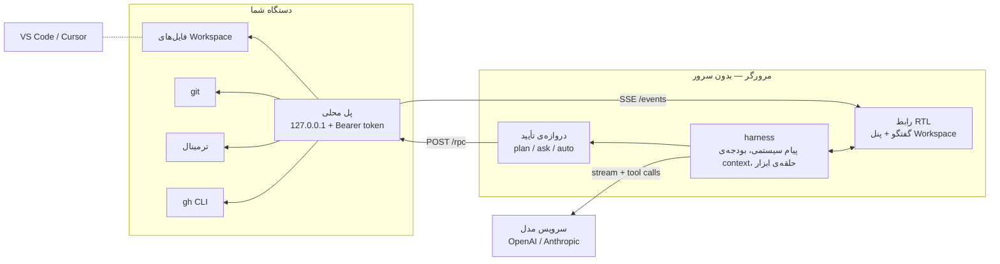

<div align="center">

# CodeBot · Persian Coding Agent

**یک coding agent وب، کاملاً راست‌چین و local-first — که روی همان پروژه‌ای کار می‌کند که در VS Code یا Cursor باز کرده‌اید.**

[](LICENSE)
[](https://react.dev)
[](https://www.typescriptlang.org)
[](https://vite.dev)
[](https://nodejs.org)
[](scripts/local-bridge.mjs)



</div>

<div dir="rtl">

**CodeBot** به سرویس‌های سازگار با **OpenAI** یا **Anthropic** وصل می‌شود، از راه یک پل امن روی `127.0.0.1` فایل‌های واقعی پروژه‌تان را می‌خواند و می‌نویسد، `build` و `test` را اجرا می‌کند، و با نشست محلی `gh` به GitHub وصل می‌شود. هیچ کلید و هیچ فایلی به سرور ما نمی‌رود — چون اصلاً سروری وجود ندارد.

## فهرست

- [چه چیزی این پروژه را متفاوت می‌کند](#چه-چیزی-این-پروژه-را-متفاوت-میکند)
- [شروع سریع](#شروع-سریع)
- [معماری](#معماری)
- [اتصال پروژه‌ی VS Code / Cursor](#اتصال-پروژهی-vs-code--cursor)
- [پنل Workspace](#پنل-workspace)
- [اختیار دستیار و دروازه‌ی تأیید](#اختیار-دستیار-و-دروازهی-تأیید)
- [ابزارهایی که مدل در اختیار دارد](#ابزارهایی-که-مدل-در-اختیار-دارد)
- [سازگاری مدل با ابزارها](#سازگاری-مدل-با-ابزارها)
- [چرا دستیار فایل را تغییر نمی‌دهد؟](#چرا-دستیار-فایل-را-تغییر-نمیدهد)
- [پروتکل پل محلی](#پروتکل-پل-محلی)
- [امنیت](#امنیت)
- [پروژه‌ها و حافظه](#پروژهها-و-حافظه)
- [توسعه](#توسعه)
- [ساختار پروژه](#ساختار-پروژه)
- [میان‌برها](#میانبرها)
- [نقشه‌ی راه](#نقشهی-راه)
- [مشارکت](#مشارکت)
- [مجوز](#مجوز)

## چه چیزی این پروژه را متفاوت می‌کند

| | |
| --- | --- |
| **راست‌چین واقعی** | تمام رابط، از درخت فایل تا نمای diff، برای فارسی طراحی شده — نه یک قالب LTR که آینه شده باشد |
| **local-first** | کلید API و گفتگوها فقط در مرورگر شما می‌مانند؛ پل محلی تنها روی loopback گوش می‌دهد |
| **کدنویسی واقعی** | خواندن، جستجو، glob، ساخت، ویرایش، حذف و تغییر نام فایل‌ها با محدودسازی کامل مسیر |
| **پنل Workspace** | درخت فایل، نمایش کد با هایلایت، نمای Source Control، ترمینال زنده و GitHub — کنار گفتگو و با عرض قابل تغییر |
| **دروازه‌ی تأیید** | هر تغییر واقعی پیش از اجرا با diff یا دستور دقیقش نشان داده می‌شود؛ سه حالت مطالعه، تأیید و خودگردان |
| **ترمینال و Git** | اجرای build/test با خروجی لحظه‌ای، به‌علاوه‌ی status، diff، log، شاخه‌ها، stage و commit |
| **GitHub** | تشخیص حساب `gh`، خواندن مخزن/Issue/PR و در صورت اجازه ساخت Issue، نظر و Pull Request |
| **هم‌گامی زنده** | تغییر فایل‌ها در ادیتور از راه جریان رویداد پل، بلافاصله در پنل دیده می‌شود |
| **پروژه و حافظه** | هر پروژه دستورالعمل، فایل و حافظه‌ی بلندمدت خودش را دارد که خودکار استخراج و به مدل داده می‌شود |
| **دو پروتکل** | `POST /chat/completions` (OpenAI) و `POST /messages` (Anthropic) با استریم و tool call |
| **ورودی تصویری** | تصویر را با دکمه، کشیدن و رها کردن یا `Ctrl` + `V` بفرستید؛ پیش از ارسال کوچک می‌شود و برای هر دو پروتکل به بلوک تصویر تبدیل می‌شود |
| **خروجی حرفه‌ای** | مارک‌داون کامل، جدول، بلوک کد با هایلایت و کپی، و فرمول‌های LaTeX |
| **بدون وابستگی سنگین** | پل محلی صفر وابستگی runtime دارد و فقط با Node اجرا می‌شود |

## شروع سریع

</div>

```bash
git clone https://github.com/MohammadA89/CodeBot.git
cd CodeBot
npm install
npm run dev
```

<div dir="rtl">

پیش‌نیاز: **Node 20 به بالا**.

سپس در صفحه‌ی نخست:

1. نوع سرویس را انتخاب کنید (**OpenAI سازگار** یا **Anthropic سازگار**).
2. `Base URL` را وارد کنید — اگر انتهای آن `/v1` نباشد، خودکار اضافه می‌شود.
3. کلید API را وارد کنید و روی **اتصال و دریافت مدل‌ها** بزنید.

اطلاعات اتصال فقط در `localStorage` همان مرورگر ذخیره می‌شود. اگر سرویس واقعی ندارید، با `npm run mock` یک سرور آزمایشی از هر دو پروتکل بالا بیاورید.

## معماری

</div>



<div dir="rtl">

هیچ مسیری از مرورگر مستقیم به فایل‌ها وجود ندارد: همه چیز از `POST /rpc` پل عبور می‌کند، و هر متد جهش‌دهنده اول از دروازه‌ی تأیید رد می‌شود.

## اتصال پروژه‌ی VS Code / Cursor

در یک ترمینال از همین مخزن، پل محلی را با مسیر پروژه‌ی مقصد اجرا کنید:

</div>

```powershell
# فقط خواندن فایل‌ها، Git و GitHub
npm run bridge -- --workspace "/path/to/repo"

# کدنویسی و اجرای build/test
npm run bridge -- --workspace "/path/to/repo" --allow-write --allow-shell

# محیط کامل: ویرایش، ترمینال و عملیات GitHub
npm run bridge -- --workspace "/path/to/repo" --allow-all
```

<div dir="rtl">

پل، آدرس و یک Token تصادفی چاپ می‌کند. در نوار بالای چت روی «اتصال Workspace» بزنید و آن‌ها را وارد کنید؛ پنجره‌ی اتصال همین دستور را بر اساس سطح دسترسی انتخابی برایتان می‌سازد. چون فایل‌ها مستقیماً در پوشه‌ی مقصد تغییر می‌کنند، نتیجه همان لحظه در VS Code یا Cursor دیده می‌شود.

| فلگ | چه چیزی باز می‌شود |
| --- | --- |
| _بدون فلگ_ | خواندن و جستجوی Workspace، وضعیت/diff/log گیت و GitHub خواندنی |
| `--allow-write` | ساخت، بازنویسی، ویرایش دقیق، حذف و تغییر نام فایل، به‌علاوه‌ی stage و commit |
| `--allow-shell` | اجرای دستور غیرتعاملی، هم یک‌باره و هم به‌صورت job زنده با خروجی لحظه‌ای |
| `--allow-github-write` | ساخت Issue، نوشتن نظر و ساخت Pull Request از راه `gh` |
| `--allow-all` | هر سه‌ی موارد بالا |
| `--port` / `--token` | تعیین دستی پورت و توکن (پیش‌فرض: `4312` و توکن تصادفی) |

سلامت پل را هر وقت خواستید بسنجید:

</div>

```bash
npm run bridge:self-test
```

<div dir="rtl">

## پنل Workspace

بعد از اتصال، پنلی کنار گفتگو باز می‌شود که عرضش با کشیدن لبه تغییر می‌کند و ذخیره می‌ماند:

- **فایل‌ها** — درخت پروژه با بارگذاری تنبل، جستجوی متنی با شماره خط، نمایش فایل با هایلایت و دکمه‌ی «باز کردن در ادیتور» که همان فایل را روی همان خط در VS Code یا Cursor باز می‌کند.
- **تغییرات** — نمای Source Control: پیام commit، فهرست جمع‌وجور فایل‌ها با نشان تک‌حرفی `M`/`U`/`A`/`D`، گروه Staged و Changes، stage کردن تک‌فایلی و diff رنگی.
- **ترمینال** — اجرای دستور با خروجی زنده، تاریخچه‌ی دستورها و دکمه‌ی توقف.
- **GitHub** — مخزن، Pull Requestها و Issueهای باز.

## اختیار دستیار و دروازه‌ی تأیید

در تنظیمات یا پنجره‌ی اتصال، یکی از سه حالت را انتخاب می‌کنید:

| حالت | رفتار |
| --- | --- |
| **فقط مطالعه** | مدل می‌خواند و پیشنهاد می‌دهد؛ هیچ تغییری اعمال نمی‌شود |
| **با تأیید من** _(پیش‌فرض)_ | پیش از هر ویرایش، دستور یا عملیات GitHub، پنجره‌ای دقیقاً همان diff یا دستور را نشان می‌دهد |
| **خودگردان** | تغییرها بدون پرسش اعمال می‌شوند |

در حالت تأیید، diffِ ویرایش پیش از نوشتن روی دیسک با `workspace.preview` ساخته می‌شود؛ یعنی چیزی که می‌بینید دقیقاً همان چیزی است که اعمال خواهد شد. هر ابزار را می‌توانید برای ادامه‌ی همان نشست مجاز کنید.

## ابزارهایی که مدل در اختیار دارد

مجموعه‌ی ابزارها بر اساس دسترسی‌های واقعی پل ساخته می‌شود؛ چیزی که فعال نباشد اصلاً به مدل معرفی نمی‌شود.

| گروه | ابزارها |
| --- | --- |
| پروژه | `remember`، `forget`، `read_project_file`، `write_project_file` |
| گفتگو | `search_chats`، `set_chat_title` |
| خواندن Workspace | `workspace_list`، `workspace_read`، `workspace_search`، `workspace_glob`، `open_in_editor` |
| نوشتن Workspace | `workspace_create`، `workspace_write`، `workspace_edit`، `workspace_delete`، `workspace_rename` |
| Git | `git_status`، `git_diff`، `git_log`، `git_branches`، `git_stage`، `git_commit` |
| ترمینال | `terminal_run` |
| GitHub | `github_repo`، `github_issues`، `github_issue`، `github_prs`، `github_pr` |
| GitHub (نوشتنی) | `github_create_issue`، `github_comment`، `github_create_pr` |

## سازگاری مدل با ابزارها

ابزارهای Workspace فقط با مدلی کار می‌کنند که **function calling** واقعی داشته باشد؛ یعنی پاسخش `tool_calls` (OpenAI) یا `tool_use` (Anthropic) داشته باشد. بعضی مدل‌های سازگار با OpenAI به‌جای این کار، نام ابزار و یک JSON نمونه را داخل متن پاسخ چاپ می‌کنند. چنین متنی هرگز اجرا نمی‌شود.

**بررسی خودکار.** وقتی Workspace متصل است، اپ برای هر جفت «سرویس + مدل» یک probe کوچک و بی‌خطر می‌فرستد: یک ابزار ساختگی `probe_ping` که به هیچ فایلی دست نمی‌زند. نتیجه در همان مرورگر ذخیره می‌شود و در انتخاب‌گر مدل به‌شکل نشان «ابزار» یا «بدون ابزار» دیده می‌شود. با دکمه‌ی «بررسی مجدد» می‌توانید دوباره امتحان کنید.

**اگر مدل ناسازگار باشد**، ابزارها اصلاً به آن معرفی نمی‌شوند، نقشه‌ی پوشه‌ها هم فرستاده نمی‌شود و بالای گفتگو یک هشدار می‌بینید. مدل به‌جای وانمود کردن، همان مانع را می‌گوید.

**اگر مدلی با وجود همه‌ی این‌ها به‌جای فراخوانی، متن تولید کند**، harness آن پاسخ را دور می‌ریزد، یک بار مدل را تصحیح می‌کند و در صورت تکرار، پیام کوتاهی نشان می‌دهد که کاری انجام نشده است. سه شکل شناسایی می‌شوند:

| شکل | نمونه |
| --- | --- |
| نام ابزار کنار payload | `{ "name": "workspace_read", "arguments": { "path": "README.md" } }` |
| فقط آرگومان‌ها، بدون نام ابزار | «خواندن فایل README.md» و بعد `{ "path": "README.md" }` |
| اعلام کار بدون انجام آن | «برای شروع، فایل README.md را می‌خوانیم» و همان‌جا تمام |

دور تصحیح فقط خواهش نمی‌کند: درخواست بعدی با `tool_choice: required` (و `{ "type": "any" }` در Anthropic) فرستاده می‌شود، پس مدل مجبور است ابزاری را واقعاً صدا بزند. اگر endpoint این حالت را نپذیرد، همان دور بدون اجبار تکرار می‌شود تا یک provider غیرمعمول کل نوبت را از بین نبرد. اجبار فقط در دور تصحیح اعمال می‌شود؛ دور عادی همیشه `auto` است.

JSON تولیدشده در متن مدل هرگز parse یا اجرا نمی‌شود — تنها فراخوانی ساختاریافته‌ی خود provider به ابزار واقعی تبدیل می‌شود.

## اتصال برقرار نمی‌شود

اپ هنگام اتصال دو کار می‌کند: `GET /models` را می‌خواند و بعد یک درخواست یک‌توکنی واقعی می‌فرستد. دلیلش این است که بعضی gatewayها فهرست مدل‌ها را به همه می‌دهند و کلید را فقط موقع تولید پاسخ بررسی می‌کنند؛ در آن حالت خواندن فهرست هیچ چیزی را ثابت نمی‌کند و اپ بدون این بررسی، اتصالی را سالم اعلام می‌کرد که با اولین پیام شکست می‌خورد.

| پیام | معنی |
| --- | --- |
| «اتصال به سرور برقرار نشد» | آدرس در دسترس نیست یا CORS بسته است — سرویس واسط بالا هست؟ |
| «فهرست مدل‌ها خوانده شد، اما سرویس همین کلید را رد کرد» | Base URL درست است ولی کلید معتبر نیست؛ کلید تازه بگیرید |
| «کلید API نامعتبر است یا رد شد (۴۰۱)» | همان مورد بالا، وسط گفتگو |

## چرا دستیار فایل را تغییر نمی‌دهد؟

اگر دستیار کد را می‌خواند اما تغییری اعمال نمی‌کند، سطح دسترسی روی همان قرص Workspace در نوار بالا نوشته شده است: «فقط خواندن»، «فقط مطالعه»، «ویرایش» یا «ویرایش و ترمینال». سه علت ممکن است:

| نشان روی قرص | علت | راه‌حل |
| --- | --- | --- |
| فقط خواندن | پل بدون `--allow-write` اجرا شده | پل را با `--allow-write` دوباره اجرا کنید (دکمه‌ی «دستور اتصال» دستور آماده را می‌دهد) |
| فقط مطالعه | حالت تأیید روی «فقط مطالعه» است | از بنر بالای گفتگو یا پنجره‌ی Workspace به «با تأیید من» تغییر دهید |
| ویرایش | مدل به‌جای اعمال تغییر، آن را توصیف یا فقط اعلام کرده | harness یک بار با `tool_choice: required` مدل را مجبور به اجرا می‌کند؛ اگر مدل حتی اجبار را هم نادیده گرفت مدل قوی‌تری انتخاب کنید |

در دو حالت اول، بنری بالای گفتگو علت را می‌گوید و دکمه‌ی رفعش را دارد. در حالت سوم، اگر مدل فایل واقعی را خوانده و بعد بلوک «تغییرات پیشنهادی» نوشته باشد، harness آن پاسخ را دور می‌ریزد و از مدل می‌خواهد تغییر را با `workspace_edit` واقعاً اعمال کند. در حالت «فقط مطالعه» این فشار اعمال نمی‌شود، چون پیشنهاد دادن دقیقاً کارِ همان حالت است.

## پروتکل پل محلی

پل یک HTTP سرویس کوچک با صفر وابستگی است. همه‌ی درخواست‌ها به `Authorization: Bearer <token>` نیاز دارند.

| مسیر | کار |
| --- | --- |
| `GET /health` | وضعیت Workspace، ادیتورهای شناسایی‌شده، Git، GitHub و دسترسی‌ها |
| `POST /rpc` | `{ "method": string, "params": object }` → `{ "ok": true, "result": … }` |
| `GET /events` | جریان SSE از تغییر فایل‌ها و خروجی زنده‌ی ترمینال |

متدها با دامنه‌ی نقطه‌دار نام‌گذاری شده‌اند: `workspace.*`، `git.*`، `shell.*`، `github.*` و `editor.open`.

## امنیت

- پل فقط روی `127.0.0.1` گوش می‌دهد و CORS را تنها برای `localhost` باز می‌کند.
- هر درخواست توکن Bearer می‌خواهد؛ توکن هر بار اجرا تصادفی ساخته می‌شود و هرگز داخل پیام‌های مدل نمی‌رود.
- هر مسیر پیش از استفاده به مسیر فیزیکی تبدیل و با ریشه‌ی Workspace مقایسه می‌شود؛ `..` و symlink به بیرون رد می‌شوند.
- نوشتن، ترمینال و عملیات نوشتنی GitHub هرکدام فلگ جداگانه دارند و بدون آن حتی به مدل معرفی نمی‌شوند؛ اگر مدل نام چنین ابزاری را حدس بزند هم، خودِ دسترسی — نه فهرست معرفی‌شده — جلویش را می‌گیرد.
- فراخوانی ابزار فقط از راه سازوکار رسمی provider پذیرفته می‌شود. متن یا JSON داخل پاسخ مدل هرگز به دستور فایل یا shell تبدیل نمی‌شود.
- اندازه‌ی بدنه، اندازه‌ی فایل، خروجی دستور و مهلت اجرا همگی سقف دارند.
- کلید API فعلاً در همین مرورگر می‌ماند؛ برای استقرار میزبانی‌شده باید تماس با مدل از سمت سرور پراکسی و کلیدها رمزگذاری شوند.

> [!WARNING]
> `--allow-all` به‌علاوه‌ی حالت «خودگردان» یعنی مدل می‌تواند بدون پرسش روی دستگاه شما دستور اجرا کند. برای مخزن‌هایی که کارِ commit‌نشده دارند، حالت «با تأیید من» را نگه دارید.

## پروژه‌ها و حافظه

از نوار کناری «پروژه‌ی جدید» را بزنید، نام و دستورالعمل پروژه را بنویسید و گفتگو را شروع کنید. هر گفتگو با منوی سه‌نقطه پین یا به یک پروژه منتقل می‌شود.

هنگام هر پاسخ، harness این‌ها را به پیام سیستمی اضافه می‌کند: دستورالعمل‌های پروژه، حافظه‌ی بلندمدت، فایل‌های پروژه (بلندها بریده می‌شوند و مدل در صورت نیاز کاملش را می‌خواند) و خلاصه‌ی بخش‌های قدیمی همان گفتگو. پس از هر پاسخ هم نکات ماندگار استخراج و ذخیره می‌شوند.

با کلیک روی نام پروژه در نوار بالا، پنل پروژه باز می‌شود: کلیات، حافظه (افزودن، ویرایش و حذف با نشان «خودکار»/«دستی»)، فایل‌ها و فهرست گفتگوها.

## توسعه

</div>

```bash
npm run dev              # سرور توسعه
npm run mock             # سرور آزمایشی هر دو پروتکل روی http://localhost:8787/v1
npm run build            # تایپ‌چک + خروجی در dist/
npm run preview          # پیش‌نمایش خروجی build
npm run bridge:self-test # آزمون path jail، diff، glob، جستجو و تغییر فایل
npm test                 # آزمون حلقه‌ی ابزار روی هر دو پروتکل، streaming و غیر آن
```

<div dir="rtl">

**نکته‌ی CORS:** اپ تماماً در مرورگر اجرا می‌شود و مستقیم با سرویس شما حرف می‌زند. خطای «اتصال به سرور برقرار نشد» معمولاً یعنی سرویس، هدرهای CORS را برای دامنه‌ی این صفحه باز نکرده است.

## ساختار پروژه

</div>

```text
src/
├── App.tsx               چیدمان اصلی، مدیریت وضعیت و جریان ارسال پیام
├── types.ts              مدل داده‌ها و تنظیمات پیش‌فرض
├── lib/
│   ├── api.ts            لایه‌ی ارتباط با API و پارسر SSE برای هر دو پروتکل
│   ├── bridge.ts         کلاینت تایپ‌شده‌ی پل محلی و جریان رویدادها
│   ├── diff.ts           پارس diff یکپارچه و کمک‌تابع‌های نمایش فایل
│   ├── harness.ts        حلقه‌ی عامل، مدیریت context، ابزارها و حافظه
│   ├── tools.ts          ابزارهای Workspace، Git، GitHub و پروژه + دروازه‌ی تأیید
│   ├── pseudotool.ts     تشخیص فراخوانی جعلی و تغییرِ توصیف‌شده اما اعمال‌نشده
│   ├── storage.ts        ذخیره‌سازی در localStorage
│   ├── highlighter.ts    هایلایت کد با مجموعه‌ی محدود و سبک زبان‌ها
│   ├── languages.ts      زبان‌های ثبت‌شده در highlight.js
│   ├── images.ts         خواندن، اعتبارسنجی و کوچک‌کردن تصویرهای پیوست
│   └── utils.ts          کمک‌تابع‌ها: تاریخ فارسی، گروه‌بندی، شناسه‌ها
├── components/
│   ├── Setup.tsx         صفحه‌ی اتصال (گام اول)
│   ├── Sidebar.tsx       ناوبری: پین‌شده‌ها، پروژه‌ها و سابقه‌ی گفتگوها
│   ├── ModelPicker.tsx   انتخاب مدل
│   ├── ChatMessage.tsx   نمایش پیام
│   ├── Markdown.tsx      رندر مارک‌داون، کد و ریاضی
│   ├── Composer.tsx      کادر نوشتن پیام و پیوست تصویر
│   ├── SettingsModal.tsx تنظیمات
│   ├── ProjectModal.tsx  پنل پروژه: کلیات، حافظه، فایل‌ها و گفتگوها
│   ├── WorkspaceModal.tsx راهنمای گام‌به‌گام اتصال و سطح دسترسی
│   ├── WorkspacePanel.tsx پنل فایل‌ها، تغییرات، ترمینال و GitHub
│   ├── DiffView.tsx      نمایش diff و فایل با شماره خط
│   ├── ApprovalDialog.tsx دروازه‌ی تأیید تغییرهای واقعی
│   ├── ResizeHandle.tsx  تغییر عرض پنل‌های کناری
│   └── Welcome.tsx       صفحه‌ی خوش‌آمد
scripts/
├── mock-api.mjs          سرور آزمایشی هر دو پروتکل، شامل مدل‌های ناسازگار برای تست
├── agent-tests.mjs       آزمون حلقه‌ی عامل: ابزار واقعی، تأیید، حالت plan و پاسخ جعلی
└── local-bridge.mjs      پل امن محلی: فایل، Git، ترمینال، GitHub و رویدادها
```

<div dir="rtl">

## میان‌برها

| کلید | کار |
| --- | --- |
| `Enter` | ارسال پیام (قابل تغییر در تنظیمات) |
| `Shift` + `Enter` | خط جدید |
| `Ctrl` + `K` | گفتگوی جدید |
| `Ctrl` + `V` | چسباندن تصویر از کلیپ‌بورد به پیام |
| `Ctrl` + `\` | نمایش یا پنهان کردن نوار کناری |
| کشیدن لبه‌ی پنل | تغییر عرض نوار کناری و پنل Workspace |

## نقشه‌ی راه

- [ ] پراکسی سمت سرور برای کلیدهای API (استقرار میزبانی‌شده)
- [ ] بازگردانی تغییرها (undo) از داخل پنل تغییرات
- [ ] چند Workspace هم‌زمان
- [ ] پشتیبانی از `.gitignore` در جستجو و درخت فایل
- [ ] پیوست فایل و تصویر در گفتگو

## مشارکت

Issue و Pull Request خوش‌آمد است. پیش از ارسال:

1. `npm run build` باید بدون خطا رد شود (تایپ‌چک هم داخلش است).
2. اگر پل را دست زدید، `npm run bridge:self-test` را هم اجرا کنید.
3. سبک کد موجود را دنبال کنید؛ راهنمای کامل در [AGENTS.md](AGENTS.md) است.
4. متن‌های رو به کاربر فارسی طبیعی باشند؛ نام پروتکل‌ها انگلیسی می‌مانند.

## مجوز

[MIT](LICENSE) © Mohammad

</div>

---

<div align="center">

**English:** CodeBot is a local-first, fully RTL Persian coding agent for the browser. It talks to any OpenAI- or Anthropic-compatible endpoint and reaches your real project through a zero-dependency localhost bridge — path-jailed file access, git, a live terminal, and the GitHub CLI — with every mutation gated behind a diff-level approval prompt. See [AGENTS.md](AGENTS.md) for the architecture notes.

</div>
